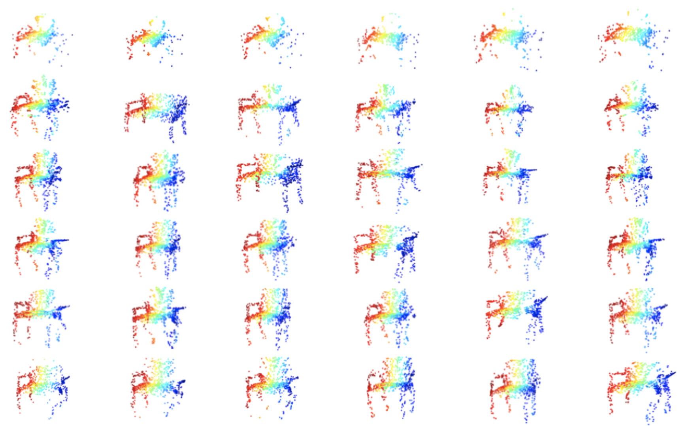
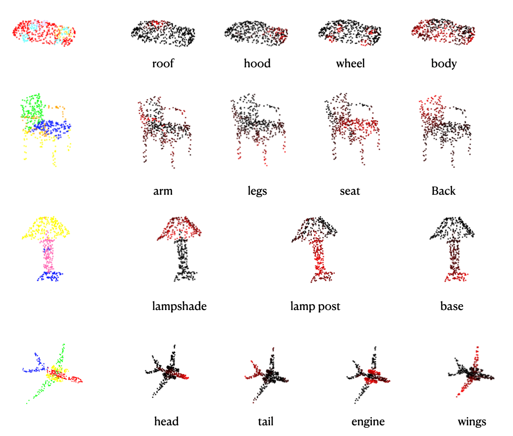

# Gradient-Based Attribution Methods for 3D Geometric Neural Style Transfer 




## Project Description

This work views the style of
3D objects from a geometric perspective. Assume we are given two 3D objects, one referred
as the content, the other referred as the style. We intent to perform "part-to-part" style transfer
by trying to naturally align the geometry of a target part of the style object with the overall
geometry of the content object.

As a point of departure, we try to tackle the part-to-part style transfer problem without relying
on a generative model or novel neural network architectures. Instead, we exploit the geometric
information concealed in the part segmentation scores of a 3D part segmentation network. To
that end, we propose potential solutions using gradient-based attribution methods, which are
designed for explaining the predictions of complex neural networks. 

## Overview

The code repository consists of the following parts:


### Folders

- ```configs```: contains configurations for running the optimization-based NST algorithm

- ```data```: contains the ShapeNet Parts dataset (see ```PartAnnotation```) and a subset of ShapeNetCore.v2 (see ```ShapeNetCore.v2```). Additionally, it contains train/test splits for training the PointNet classifier.

- ```preprocessed_meshes```: contains preprocessed meshes from ShapeNetCore.v2 in .xyz format

- ```modules```: contains PyTorch modules (models, losses)

- ```pretrained_models```:contains pretrained models

- ```scripts```: contains shell scripts from older version of the code repo for running NST experiments 


- ```legacy```: some deprecated codes

### Files

- ```utils.py```: a bunch of utility functions

- ```run_nst.py```, ```run_nst_clf.py```: run the NST algorithm with pretrained PointNet segmentation/classification network as feature extractor

- ```GradCAM.py```, ```guided_bp.py```, ```integrated_gradients.py```: implementations of the employed gradient-based attribution methods

- ```deepdream3d.py```: implementation of [DeepDream](https://www.tensorflow.org/tutorials/generative/deepdream) for point clouds

- ```dataset.py```: file for processing the ShapeNet Parts dataset for classification 

- ```train_pointnet_classifier.py```, ```test_clf.py```: files for training and testing the PointNet classifier

- ```visualization.py```: provides simple visualization of point cloud objects (e.g. rotation, interpolating between objects)


## Requirements

### Run Locally
The code has been tested in Python 3.8.3. The dependencies are listed in ```requirements.txt```. Run ```pip install -r requirements.txt``` to install the required packages.


### Run on a Remote Server

If your remote server's OS supports environment modules, you can use ```module load``` to load the packages. Make sure to first run```module list``` to check which modules are available. Here is an example in shell script:

```
declare -a moduleNames=(
"gcc/6.3.0" 
"python/3.8.5"
"cuda/10.1.243"
"cudnn/7.6.4"
"open3d"
)

for name in "${moduleNames[@]}"; do
        module load $name
done
```


## How to use this repository

### General
You can use this repository to run your own experiments for the optimization-based 3D neural style transfer with a pretrained PointNet segmentation network. You can also visualize the learned features with DeepDream and create attribution maps. Moreover, you can train our custom PointNet classifier on the ShapeNet Parts dataset. For each type of usage, it is advised to follow the instructions below.

### Preprocessing
Before running the experiments, we need to preprocess/read from the point clouds/meshes depending on the dataset we use. 

- **ShapeNet Parts**:
If you decide to use objects from ShapeNet Parts, where the feature extractor has been trained on, please use ```get_samples('path/to/object', d_type='txt')``` to obtain the samples directly.

- **ShapeNetCore.v2**:
If you decide to use objects from ShapeNetCore.v2, you have to preprocess the ```.ply``` files with ```preprocess.py```. Run ```python preprocess.py <args>```. If you do not specify the ```save_path```, it will create a folder inside ```preprocessed_meshes``` with the attributes you provide to the argparser (```exp_name, attr, subdiv_iters, format```). Moreover, the number of subdivisions depends on the object itself. Visualize the object by enabling ```--visualize``` to inspect whether to object is appropriately sampled.
Example:
```python preprocess.py --data_path path/to/obj --subdiv_iters 2 --format xyz --visualize``` performs 2 iterations of mesh subdivision and then saves the vertices as point cloud in ```.xyz``` format in ```preprocessed_meshes/experiment_0___sbd2.xyz```. The folder ```preprocessed_meshes``` contains already processed meshes.


### DeepDream
View how the object gets modified by by running 
```
python deepdream3d.py <args>
```
. Usually around 10 iterations suffice to observe feature changes. Every visualization will show the modified object and the gradients of the object's points (summed along the coordinate dimension). Brighter red means larger positive value, brighter blue means smaller negative value.

example:
```
python deepdream3d.py --obj_path lamp.xyz --obj_cat lamp --layer_ids 0 --channel_ids 0 8 16 --lr 0.01 --num_iters 10 --visualize_every 2
```

See the script for the default values. The object must be stored in  ```.xyz``` format, see **preprocessing** step.

Note that the number of channels from layer 0 to 5 are: 64, 128, 128, 512, 2048, 2048.


### Gradient-Based Attribution Methods

To visually inspect the attribution map, you can test the following methods: Guided Backpropagation, Integrated Gradients and HiResCAM. Note that HiResCAM can only be visualized with the mode ```--visualize_negpos```.  **Objects from ShapeNet Parts should be used.** You may want to inspect which part ids corresponds to the object, running ```python utils.py --<obj_category>``` prints a list of part ids corresponding to the object and a dictionary with the part names corresponding to the part ids (note that not every part is printed). The object categories can be found in ```data/PartAnnotation/synsetoffset2category.txt```. Otherwise, for quick reference, see the code below from [Torch Points 3D](https://torch-points3d.readthedocs.io/en/latest/_modules/torch_points3d/datasets/segmentation/shapenet.html):

```
category_ids = {
        "Airplane": "02691156",
        "Bag": "02773838",
        "Cap": "02954340",
        "Car": "02958343",
        "Chair": "03001627",
        "Earphone": "03261776",
        "Guitar": "03467517",
        "Knife": "03624134",
        "Lamp": "03636649",
        "Laptop": "03642806",
        "Motorbike": "03790512",
        "Mug": "03797390",
        "Pistol": "03948459",
        "Rocket": "04099429",
        "Skateboard": "04225987",
        "Table": "04379243",
    }

    seg_classes = {
        "Airplane": [0, 1, 2, 3],
        "Bag": [4, 5],
        "Cap": [6, 7],
        "Car": [8, 9, 10, 11],
        "Chair": [12, 13, 14, 15],
        "Earphone": [16, 17, 18],
        "Guitar": [19, 20, 21],
        "Knife": [22, 23],
        "Lamp": [24, 25, 26, 27],
        "Laptop": [28, 29],
        "Motorbike": [30, 31, 32, 33, 34, 35],
        "Mug": [36, 37],
        "Pistol": [38, 39, 40],
        "Rocket": [41, 42, 43],
        "Skateboard": [44, 45, 46],
        "Table": [47, 48, 49],
    }
```

Examples:

**1.Guided Backpropagation**

```
python attribution.py --obj_path data/PartAnnotation/[...]/points/[...].pts --obj_cat lamp --mode gbp --pretrained --vis_negpos --num_samples 1000 --part_id 24
```

**2.Integrated Gradients**

```
python attribution.py --obj_path data/PartAnnotation/[...]/points/[...].pts --obj_cat lamp --mode ig --pretrained --vis_magnitude --num_samples 256 --part_id 24 --n_steps 10 
```

**3.HiResCAM**

```
python attribution.py --obj_path data/PartAnnotation/[...]/points/[...].pts --obj_cat lamp --mode grad_cam --pretrained --vis_negpos --num_samples 512 --part_id 24 
```
### Neural Style Transfer
To run experiments with the optimization-based NST algorithm, see file ```run_nst.py```. The parameters in ```configs/nst_opt_based.py``` have to be set accordingly, please refer to the scipt for details on the parameters. Note that you only need to specify ```opt.output_dir = path/to/<your_folder>```, this will automatically create a folder, where the objects created during the optimization process will be stored in.
To see the summary of the optimization, run the command ```tensorboard --logdir path/to/<your_folder>```.

There are two ways to run the script: you can either choose to write a shell script (then you should set ```arg_parser = True``` in ```run_nst.py```) or you can directly write your code in ```run_nst.py```'s ```main``` part (then you should set ```arg_parser = False``` in ```run_nst.py```). 

If you only want to run a single NST experient, you can run 
```
python run_nst.py <args>
```

Below is a shell scipt example to run the NST algorithm for individual layers. For more scripts (now deprecated, for reference only), see folder ```scripts```. Don't forget to set ```SCRIPT_PATH = ../run_nst.py``` when you run inside ```scripts```. However, it is strongly recommended to  write your experiments in Python as it encourages fine-grained control. 

```
SCRIPT_PATH="run_nst.py"

CONTENT_OBJ="<path_to_content_obj>"

STYLE_OBJ="<path_to_style_obj>"

LAYERS=(
    '0' '1' '2' '3' '4' '5'       # single layer
)

for idx in "${!LAYERS[@]}"
do
  EXP_NAME="single_$((idx))"

  args=(
      --num_iters 5000
      --save_every 500
      --content_shape $CONTENT_OBJ
      --style_shape $STYLE_OBJ
      --pretrained_enc "pretrained_models/shapenet.pointnet.pth.tar"
      --output_dir "logs/table_layers"
      --style_weight 10
      --num_points 32000
      --layers ${LAYERS[idx]}
      --layers_exp_suffix $EXP_NAME
  )

  python $SCRIPT_PATH "${args[@]}"
done

```


Now we demonstrate some examples of writing experiments in the ```main``` part of ```run_nst.py```:

**1.Minimizing the style loss only in the vanilla NST objective**:

```
for w in [0.1, 1, 10, 100, 1000]: 
	opt.style_weight = w					 # set style weight
	opt.content_weight = 0				     # set content weight
	opt.output_dir = 'logs/test'			 # creates output folder
	opt.content_layers = [0, 1, 2, 3, 4]     # set content layers
	opt.style_layers = [3, 4]				 # set style layers
	opt.randn_noise = True					 # random initialization
	run_grad_mask()
```


**2. Progressively add layers**:

```
lc = []					
for i in range(6):
        lc.append(i) 								# add content layers
        opt.output_dir = "<path/to/your/directory>" # output directory
        opt.content_layers = lc
        opt.content_weight = 1
        opt.style_weight = 0
        run_grad_mask()
```

**3. Part masking**

```
style_shape = 'data/PartAnnotation/04379243/points/1ac080a115a94477c9fc9da372dd139a.pts'
style_category = 'table'
content_shape = 'data/PartAnnotation/03001627/points/1a6f615e8b1b5ae4dbbc9440457e303e.pts'
content_category = 'chair'
opt.mask_class_list = [25]      # these parts of the content object will be optimized
opt.content_part_class = 25     # part id of the content object to be optimized
opt.style_part_class = 13 		# transferring to the style of this target part
run_nst_part_specific()
```

**4. GBP-based NST**

```
style_shape = 'data/PartAnnotation/04379243/points/1ac080a115a94477c9fc9da372dd139a.pts'
style_category = 'table'
content_shape = 'data/PartAnnotation/03001627/points/1a6f615e8b1b5ae4dbbc9440457e303e.pts'
content_category = 'chair'
opt.mode = 'gbp'		# set attribution mode, currently the only implemented attribution-mask method
opt.part_id_c = 25		# provide content part id
opt.part_id_s = 13		# provide style part id
run_grad_mask()
```

**5. Attribution-based NST with HiResCAM**

```
style_shape = 'data/PartAnnotation/04379243/points/1ac080a115a94477c9fc9da372dd139a.pts'
style_category = 'table'
content_shape = 'data/PartAnnotation/03001627/points/1a6f615e8b1b5ae4dbbc9440457e303e.pts'
content_category = 'chair'
opt.part_specific = False   # if you set this to True, you have to provide a list of part classes whose points will be optimized 
#opt.mask_class_list = [25] # uncomment this if opt.part_specific = True
opt.part_id_c = 25			# provide content part id
opt.part_id_s = 13			# provide style part id
opt.attr_weight = 10		# set weight of the attribution loss
run_nst_grad_cam()
```
 
### Training PointNet Classifier on ShapeNet Parts
Note: all trained models have to be placed inside the folder ```pretrained_models```.

**Data Preparation**
Create the folder ```PartAnnotation``` in your working directory and run ```python dataset.py```. This will create two split files ```train_data.txt``` and ```test_data.txt``` inside ```data/PartAnnotation/train_test_split```. 

**Train the Classifier**
After processing the data, you can modify the parameters in the ```global configs``` section in ```train_pointnet_classifier.py``` and run the script. To test the quality of a specific classifier, you can use the function ```test_class_accuracy(ckpt_path=<path/to/pretrained/model>)```. If you have multiple models in a folder (which is saved by the training process by default), you can use the function ```select_best_model()```. You may want to tune the number of points and the batch size in the ```global variables ``` section at the beginning.


# Bibliography

**Guided Backpropagation** [Link to Paper](https://arxiv.org/abs/1412.6806)

**Integrated Gradients** [Link to Paper](https://arxiv.org/abs/1703.01365)

**GradCAM** [Link to Paper](https://arxiv.org/abs/1610.02391)

**HiResCAM** [Link to Paper](https://arxiv.org/abs/2011.08891)